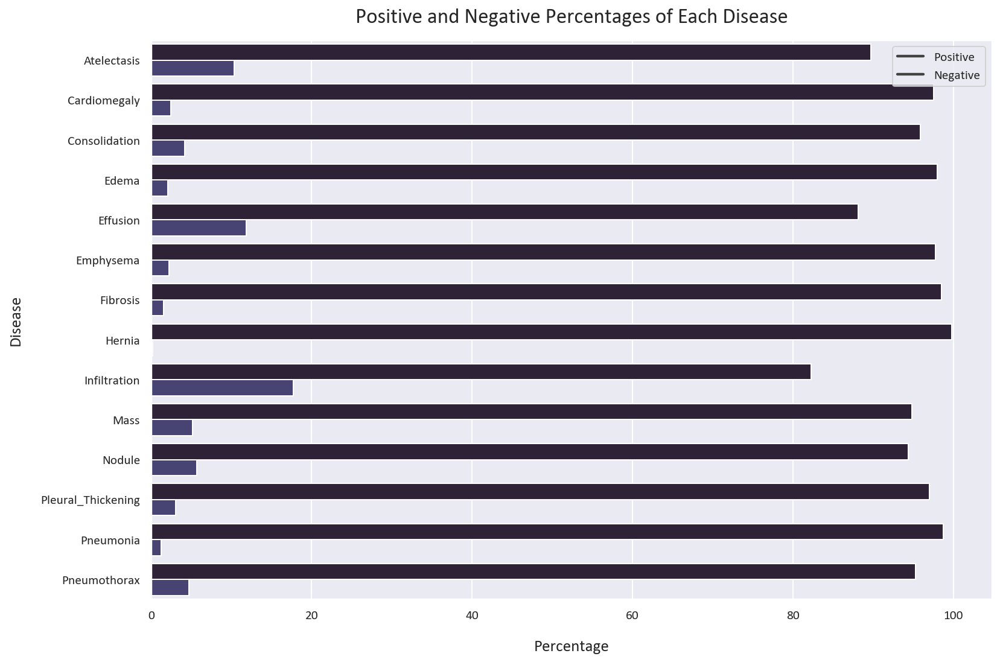
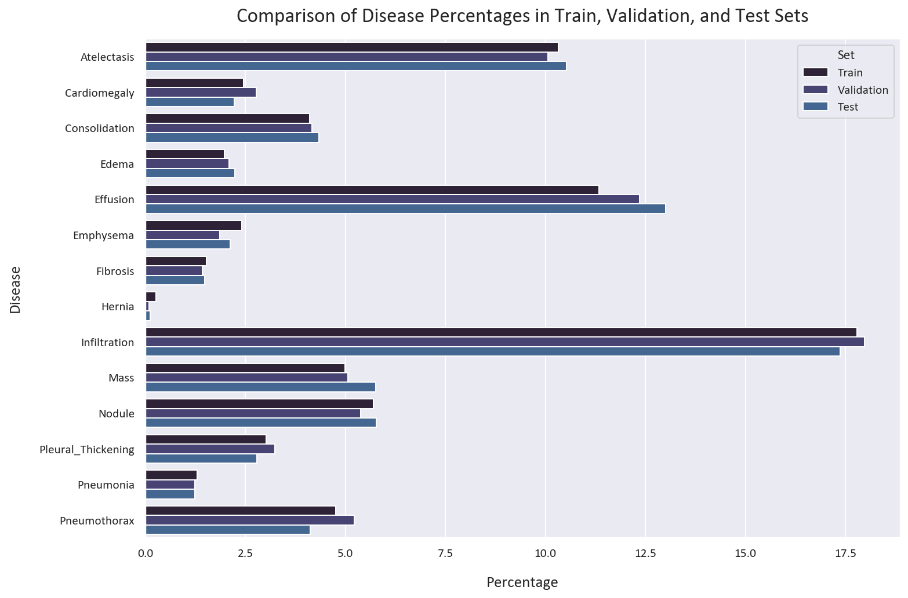
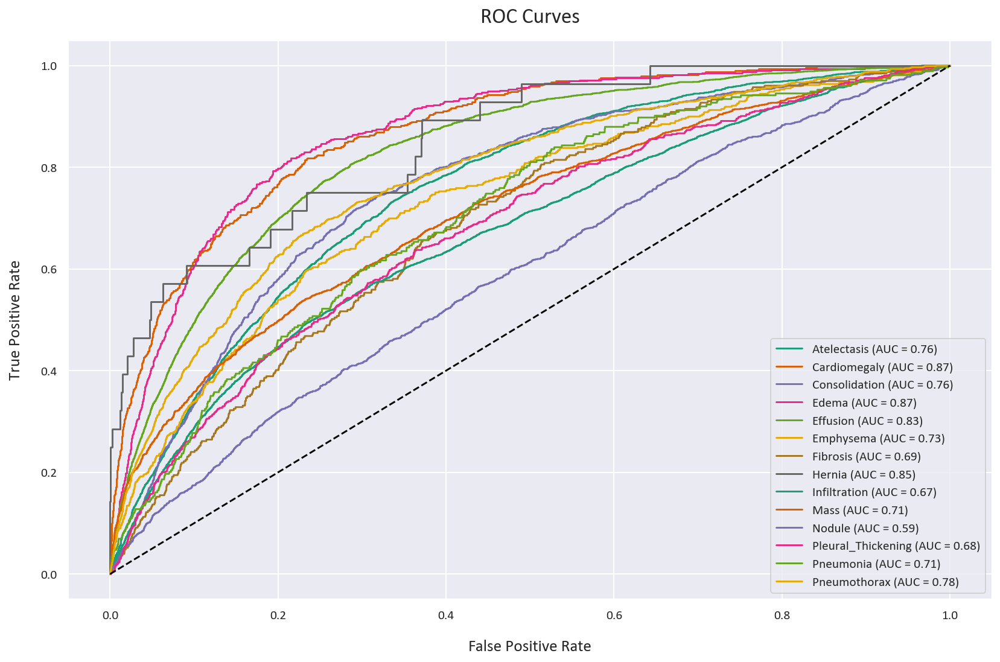
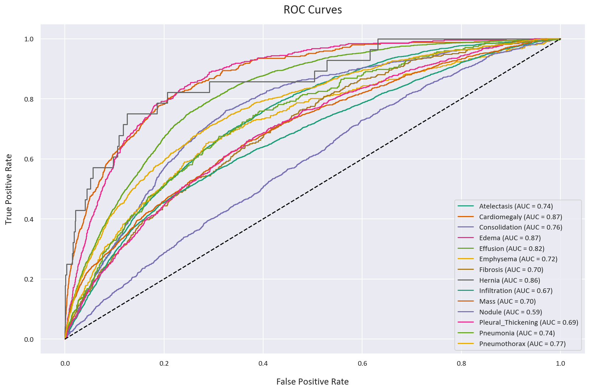
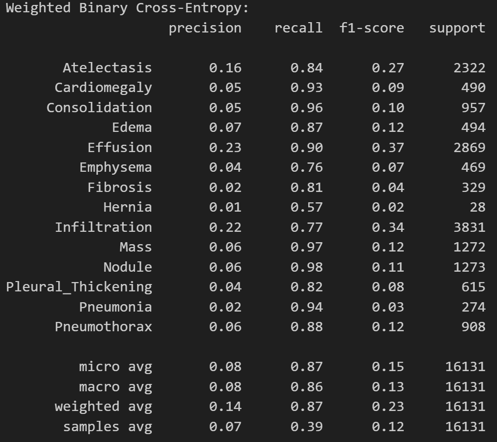

# Chest Disease Detection Using CNNs and Weighted Binary Cross Entropy Loss Based on Chest X-Ray Images

## Overview

This project aims to address the challenge of imbalanced medical datasets in the detection of thoracic diseases using chest X-ray images. The imbalance, where the number of samples in the disease class is much less than the number of samples in the normal class, can lead to models with poor predictive performance for the minority class. This is particularly dangerous in the medical field, where a model that appears to be accurate but is not can lead to misdiagnosis and potentially fatal outcomes. 

## Dataset

The dataset used is the full NIH Chest X-ray dataset, which contains 112,120 X-ray images, each labeled with up to 14 different diseases. The labels were created using Natural Language Processing (NLP) to mine the associated radiological reports. The labels are expected to be >90% accurate. You can find the dataset [here](https://www.kaggle.com/datasets/nih-chest-xrays/data/data).

## Disease Classes

There are 14 different diseases that we are trying to predict. The diseases are:
* Atelectasis: The partial or complete collapse of the lung, which is caused by a blockage of the air passages (bronchus or bronchioles) or by pressure on the lung.
* Consolidation: When the air that usually fills the small air-filled air pockets in the lung (alveoli) is replaced with a blood, pus, water or something else.
* Infiltration: An infiltrate is substance denser than air, such as pus, blood, or protein, which lingers or spreads within the parenchyma(lung tissue) of the lungs. 
* Pneumothorax: A collapsed lung that occurs when air leaks into the space between the lung and the chest wall, which puts pressure on the lung and causes it to collapse. 
* Edema: A condition in which fluid builds up in the lungs. It is often caused by heart problems, but it can also occur from nonheart-related problems.
* Emphysema: A condition in which the air sacs(alveoli) of the lungs are gradually damaged and enlarged, causing breathlessness.
* Fibrosis: The thickening and scarring of connective tissue, causing difficulty of breathing.
* Effusion: An abnormal amount of fluid between the lungs and the chest wall.
* Pneumonia: An infection that affects one or both lungs, causing the air sacs of the lungs to fill up with fluid or pus.
* Pleural_Thickening: A condition in which the pleura(thin membrane that lines the lungs and chest wall) thickens.
* Cardiomegaly: A condition in which the heart is enlarged.
* Nodule: A small mass of rounded or irregular shape, small than 3cm in diameter.
* Hernia: A condition in which part of the lung tissue is pushed through a tear, or bulging through a weak spot, in the chest wall, neck passageway or diaphragm.
* Mass: A growth of tissue that is over 3cm in diameter.

These are the percentages of each disease in the dataset:

These are the number of positive and negative cases for each disease, which shows how imbalanced the dataset is:

These are the distributions for the training, validation, and test datasets, which should be fairly similar:

## Models

Two different models are used to classify the diseases:

1. A Convolutional Neural Network (CNN) trained with binary cross-entropy loss.
2. A CNN trained with weighted binary cross-entropy loss.

## Contents

The project is organized as follows:

1. Data Collection and Cleaning
2. Exploratory Data Analysis
3. Data Preprocessing and Data Augmentation
4. Model Building and Evaluation

Each of these sections is contained in the Jupyter notebook `thoracic_disease_detection.ipynb`.

## Evaluation Metrics

In this project, due to the imbalance in the dataset where positive cases are much less than the negative cases, we need to use metrics beyond accuracy to evaluate the performance of our models. If a model is trained on this dataset, it may tend to classify most cases as negative, resulting in a high apparent accuracy. However, the model could perform poorly on the positive cases, which is dangerous in the medical field. This means that the model may tend to classify most patients as healthy, even if they have a disease, leading to potential misdiagnosis and severe health consequences.

Therefore, we use the following metrics:

* **AUC ROC**: The area under the Receiver Operating Characteristic curve. It is a probability curve that plots the True Positive Rate (TPR) against the False Positive Rate (FPR) at various threshold values and essentially separates the positive and negative cases. The higher the AUC, the better the model is at predicting positive and negative cases. However, this metric alone could be deceiving. For example, if we have a dataset with 99% negative cases and 1% positive cases, a model that classifies all cases as negative will have a high AUC ROC. This is because the model will have a high True Negative Rate (TN) and a low False Positive Rate (FP). However, this model will perform poorly on the positive cases. This is why we need to use other metrics as well. [This article](https://www.ncbi.nlm.nih.gov/pmc/articles/PMC9006654/) explains this in more detail.

* **Precision**: The number of true positives divided by the number of true positives and false positives. It is the ability of the classifier to not label a negative sample as positive. A high precision means that the classifier will not label a negative sample as positive very often. This will prevent false positives, where a patient is diagnosed with a disease when they do not have it. However, a high precision can lead to false negatives, where a patient is told they do not have a disease when they actually do. This is extremely dangerous and can lead to a delay in getting treatment, which could become fatal rapidly.
  
* **Recall**: The number of true positives divided by the number of true positives and false negatives. It is the ability of the classifier to find all positive samples. A high recall means that the classifier will not miss a positive sample very often. This will prevent false negatives, where a patient is told they do not have a disease when they actually do. However, a high recall can lead to false positives, where a patient is diagnosed with a disease when they do not have it. This is less dangerous than false negatives, as these patients are usually sent for further testing to confirm the diagnosis.

## Findings

After training and testing the two models, we found that:

1. The binary cross-entropy loss model, despite having high accuracy, is not ideal for this medical application. It correctly identifies 98.54% of negative cases but only 10.31% of positive cases. This high rate of false negatives is dangerous in a medical context, as it could lead to delayed treatment for patients who are actually sick.
   These are the AUROC values for the binary cross-entropy loss model for each of the diseases:
   
   
   
   These are the Precision and Recall values for the model:
   
   
   
3. The weighted binary cross-entropy loss model performs better in distinguishing between positive and negative cases. It correctly identifies 86.62% of positive cases and 44.84% of negative cases. Despite a lower overall accuracy, its higher recall makes it more suitable for this application.
   These are the AUROC values for the Weighted binary cross-entropy loss model for each of the diseases:
   
   
   
   These are the Precision and Recall values for the model:
   
   
   
This is much, much better than the binary cross-entropy loss model. Yes, 55.16% of healthy patients were misdiagnosed, but patients usually go for further testing to confirm the diagnosis. This is contrary to patients with a disease, where if they were told they do not have a disease, they may not go for further testing until the symptoms get worse. This is usually when it is too late and can make recovery much harder. This is why we want to minimize the number of false negatives, even if it means increasing the number of false positives.

## Usage
The notebook uses the whole dataset, which is about 45GB in size. We also used Data Augmentation for the underrepresented diseases, which added more images to the dataset. Caution: The notebook uses over 20GB of RAM, so make sure you have enough RAM before running it. I also recommend using a GPU for training as we will be training on about 83,000 images.

To run the code in this repository, you will need to have Python installed, along with the libraries listed in `requirements.txt`. You can install these with pip using the command `pip install -r requirements.txt`.

Once the dependencies are installed, you can open the notebook `thoracic_disease_detection.ipynb` in Jupyter and run the cells to execute the code.

## License

This project is licensed under the terms of the MIT license.
